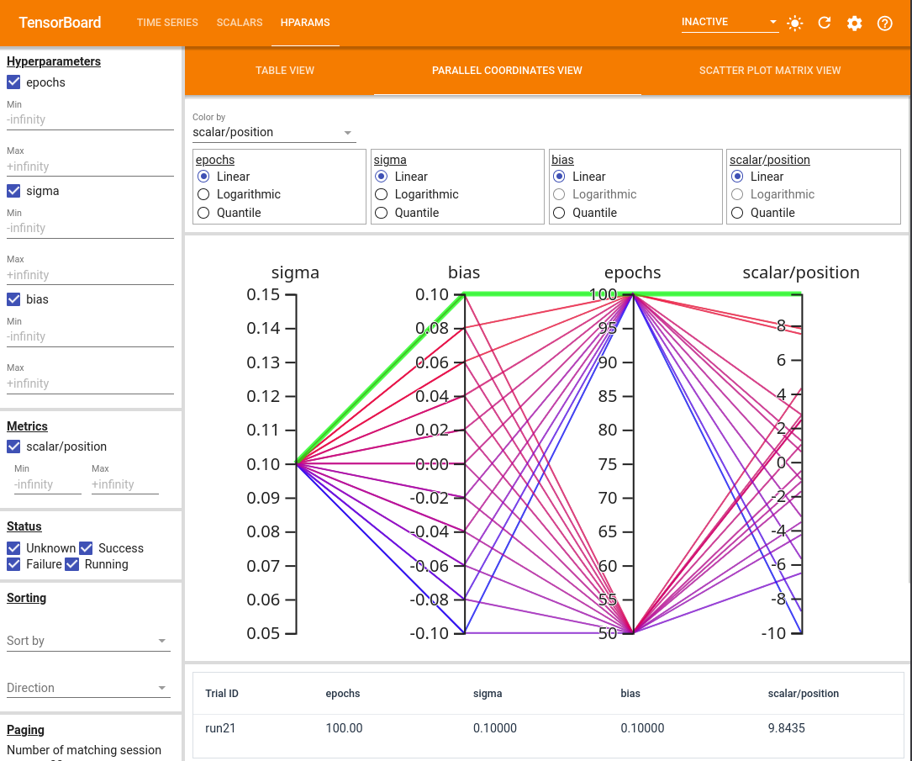

# Hyperparameter tuning

We will start this example by setting up a simple random walk experiment, and seeing the effect of the hyperparameter `bias` on the results.

First, import the packages we will need with:
```julia
using TensorBoardLogger, Logging
using Random
```
Next, we will create a function which runs the experiment and logs the results, include the hyperparameters stored in the `config` dictionary.
```julia
function run_experiment(id, config)
    logger = TBLogger("random_walk/run$id", tb_append)

    # Specify all the metrics we want to track in a list
    metric_names = ["scalar/position"]
    write_hparams!(logger, config, metric_names)

    epochs = config["epochs"]
    sigma = config["sigma"]
    bias = config["bias"]
    with_logger(logger) do
        x = 0.0
        for i in 1:epochs
            x += sigma * randn() + bias
            @info "scalar" position = x
        end
    end
    nothing
end
```
Now we can write a script which runs an experiment over a set of parameter values.
```julia
id = 0
for bias in LinRange(-0.1, 0.1, 11)
    for epochs in [50, 100]
        config = Dict(
            "bias"=>bias,
            "epochs"=>epochs,
            "sigma"=>0.1
        )
        run_experiment(id, config)
        id += 1
    end
end
```

Below is an example of the dashboard you get when you open Tensorboard with the command:
```sh
tensorboard --logdir=random_walk
```


